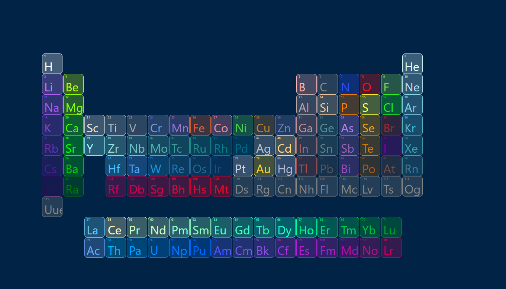

  

# Periodic Table App

This project is a Periodic Table application built with vanilla JavaScript and jquery. The application provides visual representation of elements from the periodic table and retrieves detailed information of each element from an internal file. This allows easy access and display of element properties.

## Overview

The Periodic Table app provides an interactive way to explore and learn about chemical elements. It is developed using React framework, making it easy to maintain and extend.

## Features

- View the periodic table with detailed information about each element.
- Click on an element to see its properties such as atomic number, symbol, atomic weight, etc.
- Interactive design for easy navigation and exploration.

## Required Software
Requirements
This project needs to be run on a local server due to the file read operations. To run the project, you can use one of the following tools:

- Visual Studio Code Live Server extension
- XAMPP
- Laragon

## Screenshots

## Data Source

The data used in this project is sourced from the `data.json` file. This file contains detailed information about each element in the periodic table.

## Contributing

Contributions are welcome! If you have any ideas for improvements or new features, feel free to open an issue or submit a pull request.

## License

This project is licensed under the [MIT License](https://github.com/Abdullah-Yilmazer/periodic-table/blob/master/LICENSE).
